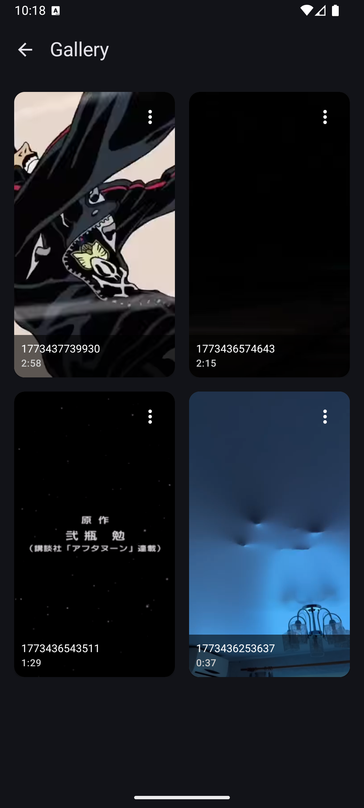
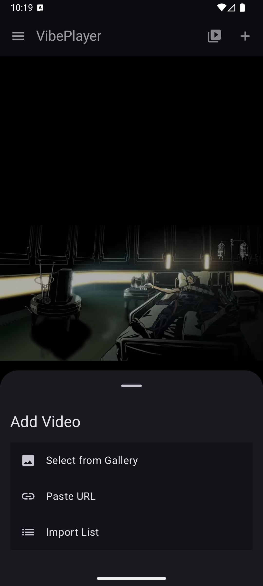
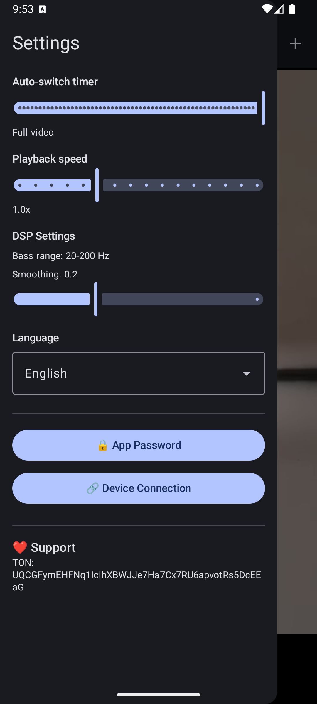

# VibePlayer

<div align="center">

**VibePlayer** is a modern Android video player with support for syncing with adult devices via **Buttplug API**.

[](https://developer.android.com/)
[](https://kotlinlang.org/)
[](https://developer.android.com/jetpack/compose)
[](https://buttplug.io/)
[](LICENSE)

[🇷🇺 Russian version](README_RU.md)

</div>

---

## 📱 Screenshots

<div align="center">

|                       Main Screen                        | Gallery |
|:--------------------------------------------------------:|:---:|
|  |  |

| Add Video | Settings |
|:---:|:---:|
|  |  |

</div>

---

## ✨ Features

- **🎬 Local video playback** — support for various video formats via ExoPlayer
- **📁 Gallery** — video library management with rename and cover options
- **🔗 Buttplug API integration** — direct device sync via Buttplug.io
- **📡 Bluetooth connection** — device support through Intiface Central
- **⏱️ Auto-switch timer** — automatic video switching by timer
- **🎛️ Playback speed** — adjustable from 0.5x to 2.0x
- **🔒 Password protection** — app lock with password
- **🌐 Multi-language** — Russian/English with auto-detection
- **📥 Video download** — URL download directly to app
- **🎨 Material Design 3** — modern UI built with Jetpack Compose
- **💾 Encrypted database** — SQLCipher for data protection

---

## 🔌 Buttplug API Integration

VibePlayer uses **Buttplug API** to sync with compatible devices:

### Supported Devices

- **Lovense** — Max, Nora, Lush, Calor, Ferri, Solace, and more
- **WeVibe** — Pivot, Connect, Verge, Moxie, Jive series
- **Kiiroo** — Pearl, Keon, Onyx, Pulse
- **Satisfyer** — Bluetooth-enabled models
- **Magic Motion** — Compatible devices
- **Other** — Any device supported by Buttplug.io

### How It Works

```
┌─────────────────┐     Bluetooth      ┌─────────────────┐
│   VibePlayer    │ ◄────────────────► │    Device       │
│   (Android)     │                    │  (Lovense, etc.)│
└────────┬────────┘                    └─────────────────┘
         │
         │ Buttplug Protocol
         ▼
┌─────────────────┐
│ Intiface Central│
│   (Server)      │
└─────────────────┘
```

1. **Intiface Central** runs on PC or mobile device
2. VibePlayer connects via **Bluetooth**
3. Video syncs with device through **Buttplug Protocol**
4. Intensity adjusts automatically based on playback

### Buttplug Commands Used

| Command | Description |
|---------|-------------|
| `DeviceScan` | Scan for nearby devices |
| `DeviceConnect` | Connect to selected device |
| `StopAllDevices` | Stop all device activity |
| `SingleMotorVibrateCmd` | Control vibration intensity |
| `BatteryLevelCmd` | Check device battery level |

### Benefits of Buttplug API

- ✅ **Single protocol** for all supported devices
- ✅ **Open specification** — fully documented
- ✅ **Active community** — regular updates and support
- ✅ **Cross-platform** — works on Android, iOS, PC

---

## 🛠️ Tech Stack

| Category | Technology |
|----------|------------|
| **Language** | Kotlin 2.0.21 |
| **UI Framework** | Jetpack Compose, Material Design 3 |
| **Architecture** | MVVM, Clean Architecture |
| **Dependency Injection** | Hilt |
| **Database** | Room + SQLCipher |
| **Async Operations** | Coroutines, Flow |
| **Navigation** | Navigation Compose |
| **Networking** | OkHttp |
| **Media Player** | ExoPlayer (Media3) |
| **Image Loading** | Coil |
| **Device Protocol** | Buttplug Android Library |

---

## 📋 Requirements

- **Android 8.0 (API 26)** or higher
- **Android 13 (API 33)** recommended for full localization support

### For Buttplug Sync

- **Intiface Central** (PC or mobile app)
- **Compatible Bluetooth device**
- **Bluetooth permission** granted

---

## 🚀 Installation

### From APK

1. **Download APK** from [Releases](https://github.com/yourusername/VibePlayer/releases)
2. **Enable installation from unknown sources** in device settings
3. **Install APK** and launch the app
4. **For Buttplug:** install [Intiface Central](https://intiface.com/central/)

### From Google Play

> Coming soon...

---

## 🔧 Build from Source

```bash
# Clone the repository
git clone https://github.com/yourusername/VibePlayer.git
cd VibePlayer

# Open in Android Studio or build via command line
./gradlew assembleDebug

# APK will be created in app/build/outputs/apk/debug/
```

### Build Requirements

- Android Studio Hedgehog or newer
- JDK 11 or higher
- Android SDK 36

---

## 📖 Usage Guide

### Quick Start with Buttplug

#### 1. Setup Intiface Central

- Download and install [Intiface Central](https://intiface.com/central/)
- Launch the application on your PC
- Enable Bluetooth server in settings

#### 2. Connect Your Device

- Open VibePlayer on your Android device
- Navigate to **Settings → Device Connection**
- Tap **Start Scan**
- Select your device from the discovered list

#### 3. Start Playback

- Add a video from gallery or paste URL
- Tap to start playback
- Device will sync automatically with video

#### 4. Configure Sync Settings

- Open **Settings** menu
- Configure **auto-switch timer** for automatic playback
- Adjust **playback speed** (0.5x - 2.0x)
- Set your preferred **language**

### Adding Videos

| Method | Description |
|--------|-------------|
| **Gallery** | Import videos from device storage |
| **URL** | Paste direct video link |
| **Batch Import** | Import multiple URLs at once |

---

## 🌐 Languages

The app supports two languages with automatic detection:

| Language | Option |
|----------|--------|
| **System Default** | Follows device language |
| **Русский** | Force Russian interface |
| **English** | Force English interface |

Change language in **Settings → Language**.

---

## 🔒 Security

- **🔐 App Password** — PIN code protection against unauthorized access
- **🔒 SQLCipher** — 256-bit AES database encryption
- **🛡️ Secure Storage** — Android Keystore for sensitive data
- **📱 Minimal Permissions** — only required permissions requested

---

## 📁 Project Structure

```
VibePlayer/
├── app/
│   ├── src/main/
│   │   ├── java/ru/spgsroot/vibeplayer/
│   │   │   ├── data/
│   │   │   │   ├── db/              # Room database + SQLCipher
│   │   │   │   ├── repository/      # Data repositories
│   │   │   │   ├── downloader/      # Video download service
│   │   │   │   └── storage/         # File storage management
│   │   │   ├── device/
│   │   │   │   └── buttplug/        # Buttplug API integration
│   │   │   ├── domain/
│   │   │   │   └── model/           # Business logic models
│   │   │   ├── ui/
│   │   │   │   ├── player/          # Video player screen
│   │   │   │   ├── gallery/         # Gallery screen
│   │   │   │   ├── settings/        # Settings screen
│   │   │   │   ├── auth/            # Authentication screen
│   │   │   │   ├── dialog/          # Dialog components
│   │   │   │   └── onboarding/      # Onboarding flow
│   │   │   ├── di/                  # Hilt dependency injection
│   │   │   ├── locale/              # Localization manager
│   │   │   └── security/            # Auth & encryption
│   │   └── res/
│   │       ├── values/              # Russian strings
│   │       └── values-en/           # English strings
│   └── build.gradle.kts
└── build.gradle.kts
```

---

## 🔗 Useful Links

### Buttplug Resources

- [**Buttplug.io Official**](https://buttplug.io/) — Official documentation
- [**Intiface Central**](https://intiface.com/central/) — Connection server
- [**Device List**](https://buttplug.io/docs/devices/) — Supported devices
- [**API Reference**](https://buttplug.io/docs/) — API documentation
- [**Discord Community**](https://discord.gg/9jRg3qf) — Get help and chat

### Development

- [**Jetpack Compose**](https://developer.android.com/jetpack/compose)
- [**Hilt**](https://developer.android.com/training/dependency-injection/hilt-android)
- [**Room Database**](https://developer.android.com/training/data-storage/room)

---

## 🤝 Contributing

Contributions are welcome! Here's how you can help:

1. **Report bugs** — Open an issue with detailed description
2. **Suggest features** — Share your ideas for improvements
3. **Improve translations** — Help localize the app
4. **Add device support** — Contribute Buttplug device configurations
5. **Submit PRs** — Send pull requests for fixes and features

### Development Setup

```bash
# Fork and clone
git clone https://github.com/yourusername/VibePlayer.git
cd VibePlayer

# Create a branch
git checkout -b feature/your-feature

# Make changes and commit
git commit -m "Add: your feature description"

# Push and create PR
git push origin feature/your-feature
```

---

## 📄 License

**MIT License** — free to use, modify and distribute.

```
Copyright (c) 2024 VibePlayer

Permission is hereby granted, free of charge, to any person obtaining a copy
of this software and associated documentation files (the "Software"), to deal
in the Software without restriction, including without limitation the rights
to use, copy, modify, merge, publish, distribute, sublicense, and/or sell
copies of the Software, and to permit persons to whom the Software is
furnished to do so, subject to the following conditions:

The above copyright notice and this permission notice shall be included in all
copies or substantial portions of the Software.
```

---

## 💖 Support

If you like this project and want to support its development, you can donate via TON:

**TON:** `UQCGFymEHFNq1IcIhXBWJJe7Ha7Cx7RU6apvotRs5DcEEAaG`

Every contribution helps keep this project alive and growing! ❤️

---

## 📞 Contact

- **GitHub:** [@spgsroot](https://github.com/spgsroot)
- **Email:** aqu.de@yandex.ru

---

<div align="center">

**VibePlayer** © 2026

Powered by **[Buttplug.io](https://buttplug.io/)**

Made with ❤️ using Kotlin & Jetpack Compose

</div>
