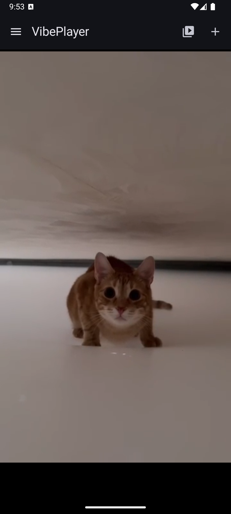

# VibePlayer

<div align="center">

**VibePlayer** — это современный видеоплеер для Android с поддержкой синхронизации с устройствами для взрослых через **Buttplug API**.

**VibePlayer** is a modern Android video player with support for syncing with adult devices via **Buttplug API**.

[](https://developer.android.com/)
[](https://kotlinlang.org/)
[](https://developer.android.com/jetpack/compose)
[](https://buttplug.io/)
[](LICENSE)

[English version](#english)

</div>

---

## 📱 Скриншоты / Screenshots

<div align="center">

| Главный экран | Галерея |
|:---:|:---:|
|  |  |

| Добавление видео | Настройки |
|:---:|:---:|
|  |  |

</div>

---

## ✨ Особенности / Features

### 🇷🇺 Русский

- **🎬 Локальное воспроизведение видео** — поддержка различных форматов видеофайлов через ExoPlayer
- **📁 Галерея** — управление видеобиблиотекой с переименованием и обложками
- **🔗 Buttplug API интеграция** — прямая синхронизация с устройствами через Buttplug.io
- **📡 Bluetooth подключение** — работа с устройствами через Intiface Central
- **⏱️ Таймер автопереключения** — автоматическое переключение видео по таймеру
- **🎛️ Скорость воспроизведения** — регулировка от 0.5x до 2.0x
- **🔒 Защита паролем** — блокировка приложения
- **🌐 Многоязычность** — русский/английский с автоопределением
- **📥 Скачивание видео** — загрузка по URL напрямую в приложение
- **🎨 Material Design 3** — современный UI на Jetpack Compose
- **💾 Шифрованная БД** — SQLCipher для защиты данных

### 🇬🇧 English

- **🎬 Local video playback** — various video formats support via ExoPlayer
- **📁 Gallery** — video library management with rename and covers
- **🔗 Buttplug API integration** — direct device sync via Buttplug.io
- **📡 Bluetooth connection** — device support through Intiface Central
- **⏱️ Auto-switch timer** — automatic video switching by timer
- **🎛️ Playback speed** — adjustable from 0.5x to 2.0x
- **🔒 Password protection** — app lock
- **🌐 Multi-language** — Russian/English with auto-detection
- **📥 Video download** — URL download directly to app
- **🎨 Material Design 3** — modern UI built with Jetpack Compose
- **💾 Encrypted DB** — SQLCipher for data protection

---

## 🔌 Buttplug API Интеграция / Buttplug API Integration

### 🇷🇺 Русский

VibePlayer использует **Buttplug API** для синхронизации с совместимыми устройствами:

#### Поддерживаемые устройства:
- Lovense (Max, Nora, Lush, Calor, и др.)
- WeVibe (серии Pivot, Connect, Verge)
- Kiiroo (Pearl, Keon, Onyx)
- Satisfyer (Bluetooth модели)
- Magic Motion
- Другие устройства с поддержкой Buttplug

#### Как это работает:
1. **Intiface Central** запускается на ПК/телефоне
2. VibePlayer подключается через **Bluetooth**
3. Видео синхронизируется с устройством через **Buttplug Protocol**
4. Интенсивность регулируется автоматически

#### Преимущества Buttplug API:
- ✅ Единый протокол для всех устройств
- ✅ Открытая спецификация
- ✅ Активное сообщество
- ✅ Регулярные обновления

### 🇬🇧 English

VibePlayer uses **Buttplug API** to sync with compatible devices:

#### Supported Devices:
- Lovense (Max, Nora, Lush, Calor, etc.)
- WeVibe (Pivot, Connect, Verge series)
- Kiiroo (Pearl, Keon, Onyx)
- Satisfyer (Bluetooth models)
- Magic Motion
- Other Buttplug-compatible devices

#### How It Works:
1. **Intiface Central** runs on PC/phone
2. VibePlayer connects via **Bluetooth**
3. Video syncs with device through **Buttplug Protocol**
4. Intensity adjusts automatically

#### Buttplug API Benefits:
- ✅ Single protocol for all devices
- ✅ Open specification
- ✅ Active community
- ✅ Regular updates

---

## 🛠️ Технологии / Tech Stack

### 🇷🇺 Русский

| Категория | Технологии |
|-----------|------------|
| **Язык** | Kotlin 2.0.21 |
| **UI** | Jetpack Compose, Material Design 3 |
| **Архитектура** | MVVM, Clean Architecture |
| **DI** | Hilt |
| **База данных** | Room + SQLCipher |
| **Асинхронность** | Coroutines, Flow |
| **Навигация** | Navigation Compose |
| **Сеть** | OkHttp |
| **Медиа** | ExoPlayer (Media3) |
| **Изображения** | Coil |
| **Buttplug** | Buttplug Android Library |

### 🇬🇧 English

| Category | Technologies |
|----------|--------------|
| **Language** | Kotlin 2.0.21 |
| **UI** | Jetpack Compose, Material Design 3 |
| **Architecture** | MVVM, Clean Architecture |
| **DI** | Hilt |
| **Database** | Room + SQLCipher |
| **Async** | Coroutines, Flow |
| **Navigation** | Navigation Compose |
| **Network** | OkHttp |
| **Media** | ExoPlayer (Media3) |
| **Images** | Coil |
| **Buttplug** | Buttplug Android Library |

---

## 📋 Требования / Requirements

### 🇷🇺 Русский

- Android 8.0 (API 26) или выше
- Android 13 (API 33) рекомендуется для полной поддержки локализации
- **Для Buttplug синхронизации:**
  - Intiface Central (ПК или мобильное приложение)
  - Совместимое Bluetooth устройство
  - Разрешение на использование Bluetooth

### 🇬🇧 English

- Android 8.0 (API 26) or higher
- Android 13 (API 33) recommended for full localization support
- **For Buttplug sync:**
  - Intiface Central (PC or mobile app)
  - Compatible Bluetooth device
  - Bluetooth permission granted

---

## 🚀 Установка / Installation

### 🇷🇺 Русский

1. **Скачайте APK** из раздела [Releases](https://github.com/spgsroot/VibePlayer/releases)
2. **Включите установку из неизвестных источников** в настройках устройства
3. **Установите APK** и запустите приложение
4. **Для Buttplug:** установите [Intiface Central](https://intiface.com/central/)

### 🇬🇧 English

1. **Download APK** from [Releases](https://github.com/spgsroot/VibePlayer/releases) section
2. **Enable installation from unknown sources** in device settings
3. **Install APK** and launch the app
4. **For Buttplug:** install [Intiface Central](https://intiface.com/central/)

---

## 🔧 Сборка из исходников / Build from Source

### 🇷🇺 Русский

```bash
# Клонируйте репозиторий
git clone https://github.com/yourusername/VibePlayer.git
cd VibePlayer

# Откройте в Android Studio или соберите через командную строку
./gradlew assembleDebug

# APK будет создан в app/build/outputs/apk/debug/
```

### 🇬🇧 English

```bash
# Clone the repository
git clone https://github.com/yourusername/VibePlayer.git
cd VibePlayer

# Open in Android Studio or build via command line
./gradlew assembleDebug

# APK will be created in app/build/outputs/apk/debug/
```

---

## 📖 Использование / Usage

### 🇷🇺 Русский

#### Быстрый старт с Buttplug:

1. **Настройка Intiface Central:**
   - Скачайте и установите [Intiface Central](https://intiface.com/central/)
   - Запустите приложение на ПК
   - Включите Bluetooth сервер

2. **Подключение устройства:**
   - Откройте VibePlayer
   - Перейдите в Настройки → Подключение устройства
   - Нажмите «Начать сканирование»
   - Выберите ваше устройство из списка

3. **Воспроизведение:**
   - Добавьте видео из галереи или по URL
   - Запустите воспроизведение
   - Устройство синхронизируется автоматически

4. **Настройка синхронизации:**
   - Откройте Настройки
   - Настройте таймер автопереключения
   - Отрегулируйте скорость воспроизведения

### 🇬🇧 English

#### Quick Start with Buttplug:

1. **Setup Intiface Central:**
   - Download and install [Intiface Central](https://intiface.com/central/)
   - Launch the app on PC
   - Enable Bluetooth server

2. **Connect Device:**
   - Open VibePlayer
   - Go to Settings → Device Connection
   - Tap «Start Scan»
   - Select your device from the list

3. **Playback:**
   - Add video from gallery or URL
   - Start playback
   - Device will sync automatically

4. **Sync Settings:**
   - Open Settings
   - Configure auto-switch timer
   - Adjust playback speed

---

## 🔌 Buttplug API Детали / Buttplug API Details

#### Connection Architecture:

```
┌─────────────────┐     Bluetooth      ┌─────────────────┐
│   VibePlayer    │ ◄────────────────► │    Device       │
│   (Android)     │                    │  (Lovense, etc.)│
└────────┬────────┘                    └─────────────────┘
         │
         │ Buttplug Protocol
         ▼
┌─────────────────┐
│ Intiface Central│
│   (Server)      │
└─────────────────┘
```

#### Buttplug Commands:
- `DeviceScan` — device scanning
- `DeviceConnect` — connect to device
- `StopAllDevices` — stop all devices
- `SingleMotorVibrateCmd` — vibration control
- `BatteryLevelCmd` — battery level check

---

## 🌐 Языки / Languages

### 🇷🇺 Русский

Приложение поддерживает два языка:

- **Системный** — автоматически определяет язык устройства
- **Русский** — принудительно русский интерфейс
- **English** — принудительно английский интерфейс

Изменить язык можно в настройках приложения.

### 🇬🇧 English

The app supports two languages:

- **System** — automatically detects device language
- **Русский** — force Russian interface
- **English** — force English interface

Language can be changed in app settings.

---

## 🔒 Безопасность / Security

### 🇷🇺 Русский

- **Пароль приложения** — защита от несанкционированного доступа
- **SQLCipher** — шифрование базы данных
- **Secure Storage** — безопасное хранение чувствительных данных
- **Bluetooth разрешения** — минимально необходимые права

### 🇬🇧 English

- **App Password** — protection against unauthorized access
- **SQLCipher** — database encryption
- **Secure Storage** — secure storage of sensitive data
- **Bluetooth permissions** — minimum required permissions

---

## 📁 Структура проекта / Project Structure

```
VibePlayer/
├── app/
│   ├── src/main/
│   │   ├── java/ru/spgsroot/vibeplayer/
│   │   │   ├── data/
│   │   │   │   ├── db/              # Room + SQLCipher
│   │   │   │   ├── repository/      # Репозитории
│   │   │   │   └── downloader/      # Загрузка видео
│   │   │   ├── device/
│   │   │   │   └── buttplug/        # Buttplug интеграция
│   │   │   ├── domain/
│   │   │   │   └── model/           # Бизнес-модели
│   │   │   ├── ui/
│   │   │   │   ├── player/          # Видеоплеер
│   │   │   │   ├── gallery/         # Галерея
│   │   │   │   ├── settings/        # Настройки
│   │   │   │   └── dialog/          # Диалоги
│   │   │   ├── di/                  # Hilt DI
│   │   │   ├── locale/              # Локализация
│   │   │   └── security/            # Безопасность
│   │   └── res/
│   │       ├── values/              # Русские строки
│   │       └── values-en/           # Английские строки
│   └── build.gradle.kts
└── build.gradle.kts
```

---

## 🔗 Полезные ссылки / Useful Links

### 🇷🇺 Русский

- [Buttplug.io Official](https://buttplug.io/) — официальная документация
- [Intiface Central](https://intiface.com/central/) — сервер для подключения
- [Список устройств](https://buttplug.io/docs/devices/) — поддерживаемые устройства
- [API Reference](https://buttplug.io/docs/) — документация API

### 🇬🇧 English

- [Buttplug.io Official](https://buttplug.io/) — official documentation
- [Intiface Central](https://intiface.com/central/) — connection server
- [Device List](https://buttplug.io/docs/devices/) — supported devices
- [API Reference](https://buttplug.io/docs/) — API documentation

---

## 🤝 Вклад / Contributing

### 🇷🇺 Русский

Вклад в проект приветствуется! Вы можете помочь:

1. Сообщить об ошибке
2. Предложить новую функцию
3. Улучшить перевод
4. Добавить поддержку новых устройств Buttplug
5. Отправить Pull Request

### 🇬🇧 English

Contributions are welcome! You can help by:

1. Reporting bugs
2. Suggesting new features
3. Improving translations
4. Adding support for new Buttplug devices
5. Sending Pull Requests

---

## 📄 Лицензия / License

MIT License — free to use, modify and distribute.

---

<div align="center">

**VibePlayer** © 2026

Powered by **Buttplug.io** | Made with ❤️ using Kotlin & Jetpack Compose

</div>
